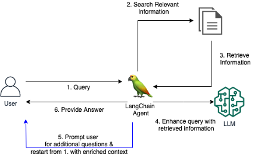
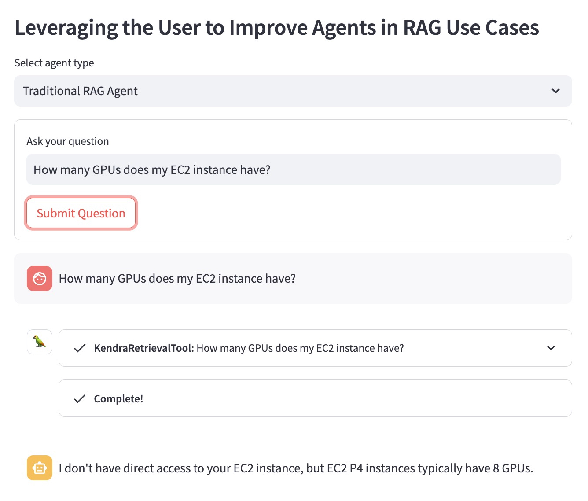
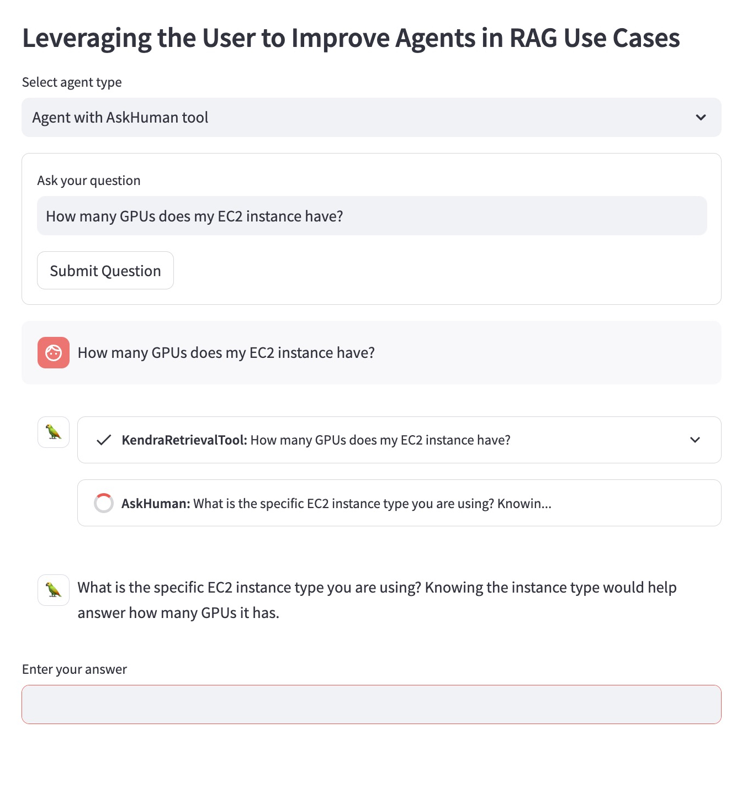
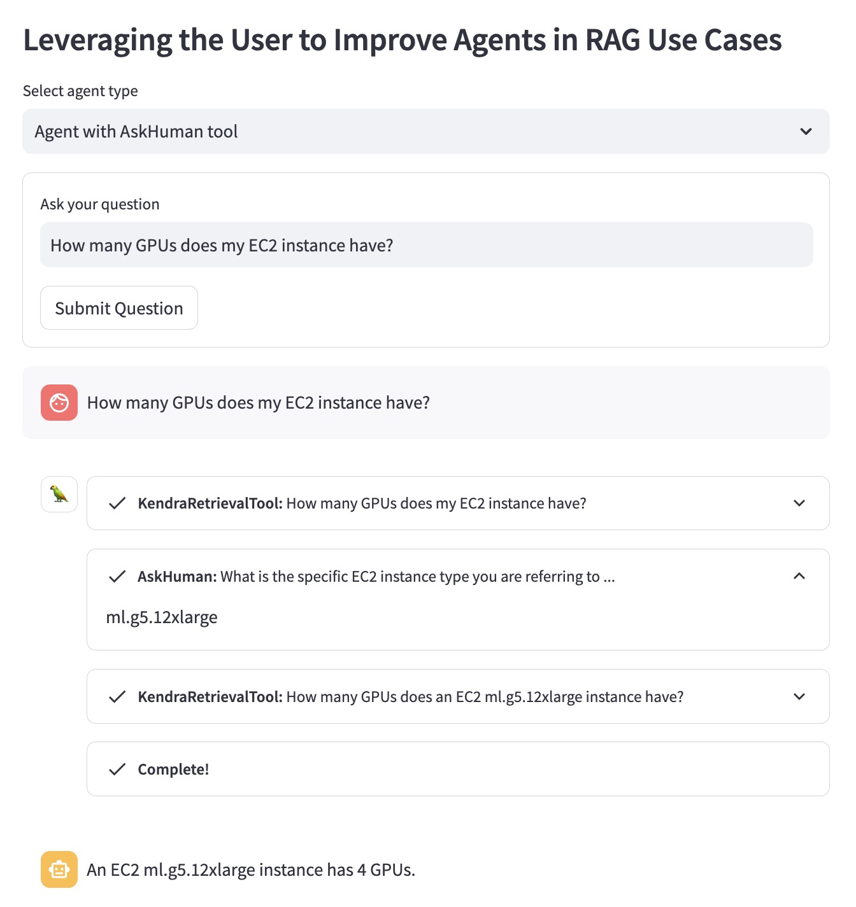

# Leveraging the User to Improve Agents in RAG Use Cases

     

## Summary

Traditional RAG systems often struggle to provide satisfactory answers when users ask vague or ambiguous questions without providing sufficient context. This leads to unhelpful responses like "I don't know" or incorrect, made-up answers provided by an LLM. This repo contains code to improve traditional RAG Agents. 

We introduce a custom LangChain Tool for a RAG Agent, which enables the Agent to engage in a conversational dialogue with a user when the initial question is unclear or too vague. By asking clarifying questions, prompting the user for more details, and incorporating contextual information, the Agent can gather the necessary context to provide an accurate, helpful answer - even from an ambiguous initial query. 

## Illustration

Let's illustrate the advantage using the following question example: "How many GPUs does my EC2 instance have?".

Traditional RAG Agent doesn't know which EC2 instance the user has in mind. Therefore, it provides an answer that is not very helpful:

     

Improved RAG Agent with `AskHuman`` tool performs two additional steps:
- 1. Asking the user which specific EC2 instance they are interested in.
- 2. Refining the search query to retrieve information for the relevant EC2 instance.

This helps the improved agent to provide a specific and helpful answer:

     
     

## Prerequisites

To run this demo in your AWS account, you need to follow these steps:
1. Deploy an Amazon Kendra Index in your AWS Account. You can use  [CloudFormation Template](https://github.com/aws-samples/amazon-kendra-langchain-extensions/blob/main/kendra_retriever_samples/kendra-docs-index.yaml) to create a new Kendra Index using the AWS online documentation of Kendra, Lex and SageMaker. 
2. The LangChain Agent relies on Foundation Models (FM) available in Amazon Bedrock, but this can be adapted to any other LLM that LangChain supports. If you don't have access to Bedrock, replace `llm` used in the LangChain Agent in `demo.py` with a [supported LLM by LangChain](https://python.langchain.com/docs/integrations/llms/).
3. To experiment with the sample frontend, you can use Amazon SageMaker Studio to run a local deployment of the Streamlit app.

## Deployment

1. Clone the repository into your environment (e.g., using SageMaker Studio).
2. Open a new Terminal and navigate to the repository folder.
3. Install dependencies by running `sh dependencies.sh` in the Terminal.
4. Specify your respective `KENDRA_INDEX_ID` in retriever parameters `demo.py`.
5. Start the Streamlit app by running `streamlit run demo.py` in the Terminal.

## Clean Up 

Note that deploying a new Kendra index and running the demo might add additional charges to your bill. To avoid incurring unnecessary costs, please delete the Amazon Kendra Index if you do not use it anymore and shut down a SageMaker Studio instance if you used it to run the demo.

## Authors

- Antonia Wiebeler, Data Scientist, AWS Generative AI Innovation Center
- Nikita Kozodoi, Applied Scientist, AWS Generative AI Innovation Center